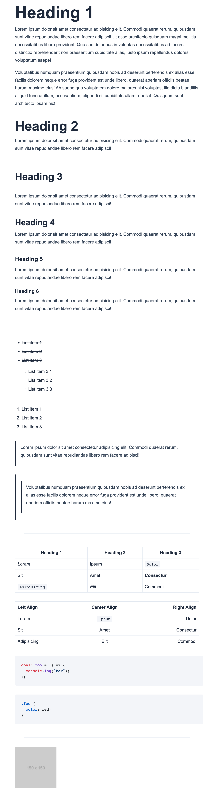

# BTECH-BREXIT

## Installation

1. `git clone https://github.com/RATIU5/btech-brexit`
2. `cd btech-brexit && npm i`
3. `npm run dev`

## App Usage

1. Write or copy any GFM into the left input box.
2. Press the green `Convert` button at the bottom to generate the HTML.
3. Copy the HTML.
4. In Canvas, edit an assignment and select the HTML button near the bottom of the editor.
5. Paste in the copied HTML.

## Style Guide

### Top-level headings are h3

All top level headings must be `h3` tags. `h1` is reserved by Canvas, and `h2` is typically too large for most cases. Stick with `h3` tags for page titles.

### Sub-headings are h5 and h6

All sub headings must transition from an `h3` to a `h5` next and then a `h6` if needed. Do not break out of that order. This setup follows like an article/book layout. The theme was designed to work best this way.

## Example

